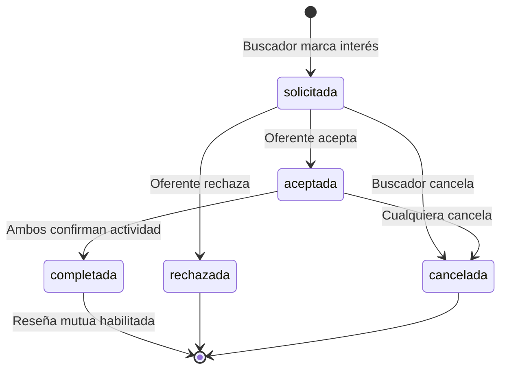

# SRS — Especificación de Requisitos de Software
## Banco de Tiempo · Plataforma de Voluntariado de Habilidades

| Campo | Valor |
|---|---|
| Proyecto | Banco de Tiempo (Plataforma de Voluntariado de Habilidades) |
| Organización | Plan Juárez · Ciudad Juárez, Chihuahua |
| Documento | 01 — Especificación de Requisitos de Software (SRS) |
| Versión | 2.1 (CI4 + React/Vite · Firebase Auth/Storage — ADR-006/007/008) |
| Fecha | 3 de junio de 2026 |
| Estándar de referencia | ISO/IEC/IEEE 29148:2018 |
| Autor técnico | Arquitectura & Full-Stack |

---

## 1. Introducción

### 1.1 Propósito

Este documento especifica los requisitos funcionales y no funcionales de la plataforma **Banco de Tiempo**, un sistema de intercambio de conocimiento no monetario en el que personas que saben enseñar una habilidad (**Oferentes**) publican lo que ofrecen, y personas que desean aprender (**Buscadores**) las descubren y contactan. El documento sirve como contrato técnico entre las partes y como fuente de verdad para el diseño, la implementación y las pruebas del MVP.

### 1.2 Alcance del MVP

El MVP cubre el ciclo completo de vinculación de extremo a extremo: registro con verificación de identidad, publicación y exploración de ofertas, solicitud de interés, aceptación, chat de coordinación, confirmación de actividad, reseña mutua, y un panel de administración con moderación y métricas. Queda explícitamente fuera del MVP todo lo listado en la sección 8 (Consideraciones Futuras).

### 1.3 Definiciones, acrónimos y abreviaturas

| Término | Definición |
|---|---|
| Oferente | Usuario que publica una o más habilidades que puede enseñar |
| Buscador | Usuario que navega y contacta oferentes |
| Oferta | Publicación de una habilidad concreta hecha por un Oferente |
| Vinculación / Match | Relación entre un Buscador y una Oferta, con un estado que transiciona en el tiempo |
| Verificación | Proceso de aprobación de identidad mediante carga de documento, revisado por un administrador |
| RBAC | Control de Acceso Basado en Roles (Role-Based Access Control) |
| MVP | Producto Mínimo Viable (Minimum Viable Product) |
| PII | Información de Identificación Personal (Personally Identifiable Information) |

### 1.4 Stack tecnológico de referencia

| Capa | Tecnología | Versión objetivo (jun-2026) |
|---|---|---|
| Lenguaje backend | PHP | 8.3+ |
| Framework backend | CodeIgniter (API REST pura) | 4.7.x |
| Frontend (SPA) | React + Vite + TypeScript | React 19 · Vite 6 |
| Estado de cliente | TanStack Query (server-state) + Zustand (UI-state) | — |
| CSS | Tailwind CSS | 4.x |
| Base de datos relacional (fuente de verdad) | MySQL | 8.0+ |
| Mensajería en tiempo real | Cloud Firestore | — |
| Almacenamiento de documentos | Storage privado cifrado (disco local cifrado o S3-compatible) | — |
| Autenticación | Firebase Authentication (email/contraseña, Google, Facebook, Microsoft); CI4 verifica el ID token | Firebase Admin SDK |
| Almacenamiento de archivos | Firebase Storage (imágenes públicas vía CDN; documentos de identidad privados, cifrados app-side) | — |
| Despliegue | VPS propio de Plan Juárez (Linux); Nginx sirve la SPA y hace proxy a la API | — |

> **Nota de versiones (v2.1).** Arquitectura **desacoplada**: backend API-only en CodeIgniter 4.7 + frontend SPA en React 19 + Vite ([ADR-006](../02-arquitectura/ADR-006-cambio-stack-ci4-react.md)). **Firebase** provee identidad ([ADR-008](../02-arquitectura/ADR-008-firebase-authentication.md)), chat (Firestore) y archivos ([ADR-007](../02-arquitectura/ADR-007-firebase-storage-imagenes.md)). El dominio y los requisitos de negocio de este SRS no cambian con el stack; solo cambia cómo se implementan auth y almacenamiento.

---

## 2. Descripción general

### 2.1 Perspectiva del producto

Banco de Tiempo es una aplicación web con arquitectura desacoplada: una **SPA reactiva en React** que consume una **API REST en CodeIgniter 4**, respaldada por una base de datos relacional como **única fuente de verdad** para identidad, autorización y todo el dominio transaccional. El chat en tiempo real se delega a Firestore como **canal**, nunca como autoridad: cada escritura de mensaje se valida contra el estado de la vinculación que vive en MySQL.

### 2.2 Roles de usuario

| Rol | Descripción | Privilegios clave |
|---|---|---|
| Invitado | Visitante no autenticado | Ver landing y exploración pública limitada |
| Usuario (Oferente / Buscador / Ambos) | Persona registrada y verificada | Publicar ofertas, marcar interés, chatear, reseñar |
| Moderador | Administrador con permisos de moderación | Verificar identidades, despublicar ofertas, gestionar tickets |
| Super-administrador | Administrador con control total | Todo lo de Moderador + gestión de admins y categorías |

> Un mismo usuario puede ser Oferente y Buscador simultáneamente. El rol es un atributo de la *actividad*, no una cuenta separada.

### 2.3 Suposiciones y dependencias

- El despliegue se realiza sobre infraestructura controlada por Plan Juárez (VPS Linux), con HTTPS forzado mediante certificado TLS válido.
- La verificación de identidad en el MVP es **manual**: el usuario carga un documento y un Moderador lo aprueba o rechaza.
- Las notificaciones del MVP se entregan por **correo electrónico**. Las notificaciones push quedan para v2.
- Se dispone de un proyecto de Firebase con Firestore habilitado para el módulo de chat.

---

## 3. Requisitos funcionales

La notación es `RF-<módulo>-<n>`. Cada requisito es verificable.

### 3.1 Autenticación y cuentas (AUT)

> **Auth vía Firebase Authentication (ADR-008).** El inicio de sesión, el registro, la verificación de correo y la recuperación de contraseña los gestiona Firebase Authentication. CI4 verifica el ID token y mapea el usuario local. La verificación de **identidad** (módulo VER) es independiente y se conserva.

| ID | Requisito | Prioridad |
|---|---|---|
| RF-AUT-01 | El sistema permite registro/inicio de sesión mediante Firebase Authentication con **email/contraseña** y proveedores **Google, Facebook y Microsoft**. Las credenciales las custodia Firebase (sin contraseñas en MySQL). | Must |
| RF-AUT-02 | El sistema aprovisiona el usuario local (mapeo `firebase_uid` ↔ usuario) en el primer acceso válido; garantiza unicidad de correo y deduplica cuentas por correo verificado. | Must |
| RF-AUT-03 | El correo se verifica mediante el flujo nativo de Firebase (`email_verified`). | Must |
| RF-AUT-04 | La protección de fuerza bruta y la política de contraseñas las aplica Firebase; CI4 añade throttling a sus endpoints. | Must |
| RF-AUT-05 | El cierre de sesión lo realiza el cliente (Firebase `signOut`); el backend puede forzar cierre global con `revokeRefreshTokens(uid)`. | Must |
| RF-AUT-06 | La recuperación de contraseña usa el flujo nativo de restablecimiento de Firebase. | Must |
| RF-AUT-07 | El acceso al panel de administración exige autenticación reforzada (MFA de Firebase para administradores). | Should |

### 3.2 Verificación de identidad (VER)

| ID | Requisito | Prioridad |
|---|---|---|
| RF-VER-01 | El usuario puede cargar uno o más documentos de identidad (imagen/PDF). | Must |
| RF-VER-02 | Los documentos se almacenan en Firebase Storage (prefijo privado, deny-by-default), cifrados del lado de la app antes de subir; nunca en la base de datos ni en rutas públicas. | Must |
| RF-VER-03 | El acceso a un documento solo es posible mediante URL firmada de corta expiración (Admin SDK de Firebase) generada por el backend para un Moderador autorizado, con registro en auditoría. | Must |
| RF-VER-04 | El usuario inicia con estado `no_verificado`; transiciona a `pendiente` al cargar documentos. | Must |
| RF-VER-05 | Un Moderador puede aprobar (`verificado`) o rechazar (`rechazado`, con motivo) la verificación. | Must |
| RF-VER-06 | El usuario recibe notificación por correo del resultado de su verificación. | Must |
| RF-VER-07 | Solo usuarios `verificado` pueden publicar ofertas o marcar interés. | Must |

### 3.3 Ofertas (OFE)

| ID | Requisito | Prioridad |
|---|---|---|
| RF-OFE-01 | Un Oferente verificado puede crear una oferta con: título, categoría, descripción (150–200 car. en tarjeta, completa en detalle), modalidad (presencial/virtual), zona/ciudad si es presencial, capacidad (individual/grupal) y capacidad máxima. | Must |
| RF-OFE-02 | Un Oferente puede editar, pausar, reanudar y eliminar sus propias ofertas. | Must |
| RF-OFE-03 | Una oferta puede tener galería de imágenes opcional. | Should |
| RF-OFE-04 | Una oferta pausada o eliminada no aparece en la exploración. | Must |
| RF-OFE-05 | El sistema valida y sanitiza todo el contenido de la oferta contra XSS antes de almacenarlo y al renderizarlo. | Must |

### 3.4 Exploración y descubrimiento (EXP)

| ID | Requisito | Prioridad |
|---|---|---|
| RF-EXP-01 | Un Buscador puede navegar ofertas activas por categoría. | Must |
| RF-EXP-02 | El sistema ofrece al menos 3 filtros operativos: categoría, modalidad, zona y disponibilidad. | Must |
| RF-EXP-03 | El sistema presenta las ofertas como tarjetas con foto del oferente, título, descripción breve, modalidad, zona y capacidad. | Must |
| RF-EXP-04 | El sistema muestra el detalle completo de una oferta con perfil del oferente, disponibilidad y botón "Me interesa". | Must |
| RF-EXP-05 | La exploración pagina los resultados y evita el problema N+1 mediante eager loading. | Must |

### 3.5 Vinculación / Match (VIN)

| ID | Requisito | Prioridad |
|---|---|---|
| RF-VIN-01 | Un Buscador verificado puede marcar interés en una oferta, generando una vinculación en estado `solicitada`. | Must |
| RF-VIN-02 | El sistema impide solicitudes duplicadas activas del mismo Buscador a la misma oferta. | Must |
| RF-VIN-03 | El Oferente recibe notificación de cada nuevo interesado. | Must |
| RF-VIN-04 | El Oferente puede aceptar (`aceptada`) o rechazar (`rechazada`) cada solicitud. | Must |
| RF-VIN-05 | Al aceptar, el sistema habilita el chat entre ambas partes. | Must |
| RF-VIN-06 | Ambas partes deben confirmar la realización de la actividad para transicionar a `completada`. | Must |
| RF-VIN-07 | Cualquiera de las partes puede cancelar antes de completar (`cancelada`), registrando quién y cuándo. | Must |
| RF-VIN-08 | Las transiciones de estado se ejecutan dentro de una transacción de base de datos y respetan la máquina de estados (sección 4). | Must |

### 3.6 Mensajería (MSG)

| ID | Requisito | Prioridad |
|---|---|---|
| RF-MSG-01 | El chat se habilita únicamente después de que el Oferente acepta la solicitud. | Must |
| RF-MSG-02 | El chat soporta mensajes de texto en tiempo real (sin llamadas ni video en MVP). | Must |
| RF-MSG-03 | Cada escritura de mensaje se autoriza contra el estado `aceptada`/`completada` de la vinculación en MySQL. | Must |
| RF-MSG-04 | Los mensajes son auditables por un Moderador únicamente en el contexto de un reporte activo. | Must |
| RF-MSG-05 | Ambas partes reciben notificación de nuevo mensaje. | Should |

### 3.7 Reseñas (RES)

| ID | Requisito | Prioridad |
|---|---|---|
| RF-RES-01 | La reseña mutua se habilita solo cuando la vinculación está `completada`. | Must |
| RF-RES-02 | Cada parte puede dejar una calificación (1–5) y un comentario sobre la otra, una sola vez por vinculación. | Must |
| RF-RES-03 | Las reseñas se muestran en el perfil del usuario reseñado. | Must |
| RF-RES-04 | Una reseña puede ser reportada y, si procede, eliminada por administración. | Must |
| RF-RES-05 | El sistema recuerda por correo dejar reseña tras la actividad. | Should |

### 3.8 Notificaciones (NOT)

| ID | Evento | Receptor | Canal MVP |
|---|---|---|---|
| RF-NOT-01 | Nuevo interesado en tu oferta | Oferente | Correo |
| RF-NOT-02 | Tu solicitud fue aceptada | Buscador | Correo |
| RF-NOT-03 | Tu solicitud fue rechazada | Buscador | Correo |
| RF-NOT-04 | Nuevo mensaje en chat | Ambos | Correo / in-app |
| RF-NOT-05 | Verificación aprobada/rechazada | Usuario | Correo |
| RF-NOT-06 | Reporte recibido / resuelto | Usuario | Correo |
| RF-NOT-07 | Recordatorio de reseña | Ambos | Correo |

> Todas las notificaciones por correo se procesan de forma asíncrona mediante colas (Redis) para no bloquear el request.

### 3.9 Tickets y reportes (TIC)

| ID | Requisito | Prioridad |
|---|---|---|
| RF-TIC-01 | Cualquier usuario puede crear un ticket (reporte o sugerencia) que recibe un folio único. | Must |
| RF-TIC-02 | Un usuario puede reportar a otro usuario, una oferta, un mensaje o una reseña. | Must |
| RF-TIC-03 | Un Moderador puede asignarse o asignar tickets y cambiar su estado (`abierto`, `en_proceso`, `resuelto`, `cerrado`). | Must |
| RF-TIC-04 | El cierre de un ticket documenta la resolución. | Must |

### 3.10 Administración (ADM)

| ID | Requisito | Prioridad |
|---|---|---|
| RF-ADM-01 | Login seguro y separado para administradores. | Must |
| RF-ADM-02 | Lista de usuarios con estado de verificación e historial de reportes. | Must |
| RF-ADM-03 | Revisión y aprobación/rechazo de documentos de identidad. | Must |
| RF-ADM-04 | Suspensión y baja de cuentas. | Must |
| RF-ADM-05 | Revisión y despublicación de ofertas que incumplan lineamientos. | Must |
| RF-ADM-06 | Moderación (eliminación) de reseñas reportadas. | Must |
| RF-ADM-07 | Seguimiento del estado de cada vinculación y acceso a su conversación solo bajo reporte activo. | Must |
| RF-ADM-08 | Gestión de tickets (bandeja, asignación, cierre documentado). | Must |
| RF-ADM-09 | Gestión de categorías (alta de nuevas categorías más allá de las iniciales). | Must |
| RF-ADM-10 | El Super-administrador puede crear, editar y revocar cuentas de Moderador. | Must |

### 3.11 Métricas (MET)

El panel admin muestra al menos estas 8 métricas con datos reales:

1. Total de usuarios registrados vs. verificados
2. Nuevos registros por período
3. Ofertas activas por categoría
4. Vinculaciones por estado (solicitadas / aceptadas / completadas / canceladas)
5. Tasa de aceptación por categoría
6. Calificación promedio de la plataforma
7. Reportes recibidos y tiempo promedio de resolución
8. Actividad por zona de la ciudad

---

## 4. Máquina de estados de la Vinculación

La vinculación es el núcleo transaccional. Sus transiciones son las únicas permitidas; cualquier otra es rechazada por la capa de servicio.

**Invariantes:**

- El chat existe **solo** en estados `aceptada` y `completada`.
- La reseña existe **solo** en estado `completada`.
- `completada` exige doble confirmación (Oferente **y** Buscador).
- Toda transición se ejecuta en una transacción ACID y registra autor y marca de tiempo (auditoría).

---

## 5. Requisitos no funcionales

### 5.1 Seguridad (RNF-SEG)

| ID | Requisito |
|---|---|
| RNF-SEG-01 | Toda la aplicación opera bajo HTTPS forzado (HSTS habilitado). |
| RNF-SEG-02 | Las credenciales las custodia Firebase Authentication; la plataforma no almacena contraseñas en su base de datos. CI4 verifica el ID token de Firebase en cada petición. |
| RNF-SEG-03 | Las consultas usan exclusivamente sentencias preparadas / binding de parámetros (cero concatenación de SQL). |
| RNF-SEG-04 | Todo output se escapa para prevenir XSS; el contenido enriquecido se purifica con lista blanca. |
| RNF-SEG-05 | Las mutaciones se autentican con `Authorization: Bearer <Firebase ID token>` (no cookies de sesión), por lo que el CSRF clásico no aplica; el único endpoint con cookie quedó eliminado con Firebase Auth (ADR-008). |
| RNF-SEG-06 | La autorización se implementa con RBAC mediante filtros de ruta y PolicyServices (autorización de objeto); principio de menor privilegio. |
| RNF-SEG-07 | Los documentos de identidad se cifran app-side antes de subir a Firebase Storage (blob opaco); los datos sensibles se cifran en reposo y el tránsito es siempre cifrado (HTTPS). |
| RNF-SEG-08 | Los secretos viven en variables de entorno, nunca en el repositorio. |
| RNF-SEG-09 | El sistema mantiene un registro de auditoría inmutable de acciones sensibles (verificaciones, suspensiones, accesos a chat bajo reporte). |
| RNF-SEG-10 | El detalle completo del modelo de amenazas se especifica en el documento 04 (Plan de Seguridad). |

### 5.2 Rendimiento (RNF-REN)

| ID | Requisito |
|---|---|
| RNF-REN-01 | Las vistas de exploración resuelven en menos de 500 ms bajo carga nominal, sin consultas N+1. |
| RNF-REN-02 | Las consultas de listado usan eager loading selectivo de columnas e índices adecuados. |
| RNF-REN-03 | Los envíos de correo y la generación de reportes pesados se procesan en colas asíncronas. |
| RNF-REN-04 | Las métricas del admin se sirven con caché estratégico invalidado por evento. |

### 5.3 Disponibilidad y mantenibilidad (RNF-MAN)

| ID | Requisito |
|---|---|
| RNF-MAN-01 | El código cumple SOLID y Clean Code; tipado estricto en PHP 8.3. |
| RNF-MAN-02 | La lógica de negocio reside en Services; el acceso a datos en Repositories; la validación en reglas de validación (Validation) y la autorización en PolicyServices. |
| RNF-MAN-03 | Cobertura de pruebas objetivo ≥ 80% en la capa de servicios y flujos críticos (ver documento 06). |
| RNF-MAN-04 | Migraciones versionadas y reversibles; ningún cambio de esquema fuera de migración. |

### 5.4 Usabilidad y accesibilidad (RNF-USA)

| ID | Requisito |
|---|---|
| RNF-USA-01 | Diseño mobile-first con Tailwind. |
| RNF-USA-02 | La interfaz cumple contraste y navegación por teclado conforme a WCAG 2.1 AA en flujos críticos. |
| RNF-USA-03 | Mensajes de error claros y accionables, sin filtrar detalles técnicos sensibles. |

### 5.5 Privacidad y cumplimiento (RNF-PRI)

| ID | Requisito |
|---|---|
| RNF-PRI-01 | La plataforma trata datos personales conforme a la legislación mexicana aplicable (LFPDPPP). |
| RNF-PRI-02 | El usuario puede solicitar la baja de su cuenta y la eliminación de sus datos personales (salvo retención legal). |
| RNF-PRI-03 | Los documentos de identidad se eliminan o anonimizan una vez cumplida su finalidad de verificación, según política de retención. |

> La asesoría legal sobre LFPDPPP debe validarse con un profesional; este documento describe requisitos técnicos, no constituye asesoría jurídica.

---

## 6. Criterios de aceptación del MVP

| Criterio | Condición mínima aceptable | Requisitos ligados |
|---|---|---|
| Registro y carga de documentos | Flujo completo sin errores en los 3 roles | RF-AUT-*, RF-VER-* |
| Aprobación/rechazo de verificaciones | Panel funcional con cambio de estado y notificación por correo | RF-VER-05/06, RF-ADM-03 |
| Exploración con filtros | Grid con al menos 3 filtros operativos | RF-EXP-02 |
| Flujo de match de extremo a extremo | Interés → aceptación → chat habilitado sin fallos | RF-VIN-*, RF-MSG-01 |
| Marcar actividad como completada | Doble confirmación habilita reseña | RF-VIN-06, RF-RES-01 |
| Sistema de tickets | Creación con folio y cambio de estado desde admin | RF-TIC-*, RF-ADM-08 |
| Métricas básicas | Al menos 6 métricas activas con datos reales | RF-MET (sección 3.11) |

---

## 7. Resolución de las preguntas abiertas de la propuesta

| # | Pregunta original | Decisión MVP |
|---|---|---|
| 1 | ¿Verificación manual o automatizada? | **Manual** por administrador en MVP; integración con servicio automatizado documentada para v2. |
| 2 | ¿Cómo se marca "completada"? | **Doble confirmación** (ambas partes). |
| 3 | ¿Push o solo correo? | **Solo correo** en MVP; push (FCM) en v2. |
| 4 | ¿Admin monolítico o múltiple? | **RBAC con dos niveles**: Super-administrador y Moderador. |
| 5 | ¿Nombre de la plataforma? | Provisional: **Banco de Tiempo** (sujeto a confirmación de marca). |

---

## 8. Consideraciones futuras (fuera del MVP, v2)

- Verificación automatizada de identidad (Truora / Metamap / INE APIs, ~$1.50–$3.00 USD por verificación).
- Notificaciones push móviles (Firebase Cloud Messaging).
- Apps nativas iOS / Android.
- Sistema de recomendaciones basado en historial.
- Mapa interactivo de ofertas por zona.

> Nota: el **login social** (Google, Facebook, Microsoft), antes considerado v2, **se incorpora al MVP** vía Firebase Authentication (ADR-008).

---

## 9. Trazabilidad

Cada requisito funcional de este SRS se mapea a: (a) una o más entidades del modelo de datos (documento 03), (b) uno o más endpoints de la API (documento 05), y (c) uno o más casos de prueba (documento 06). La matriz de trazabilidad completa se mantiene en el documento 06.

---

*Documento 01 de la documentación técnica de Banco de Tiempo · Plan Juárez · v2.1 · 3-jun-2026*
