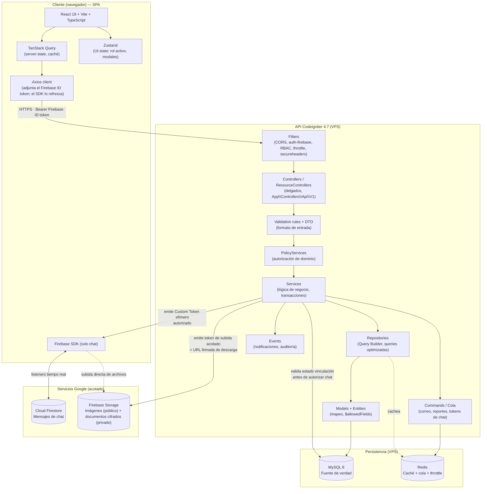
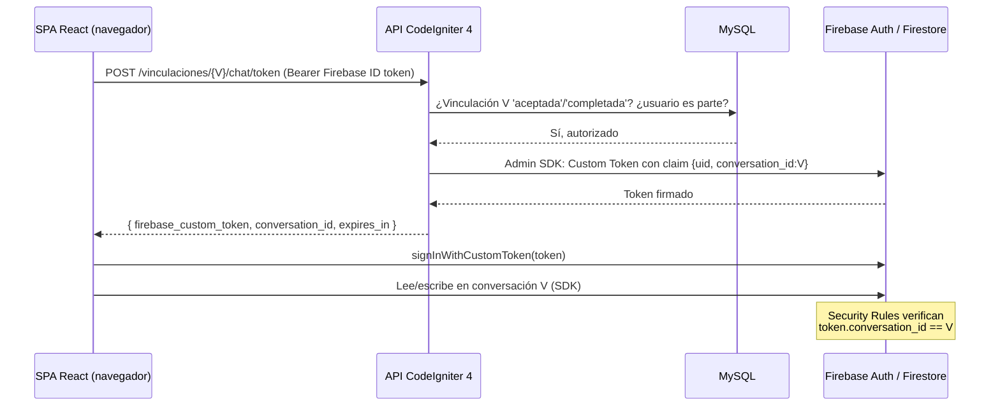
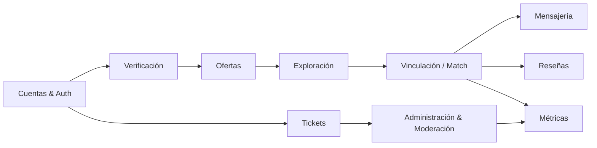
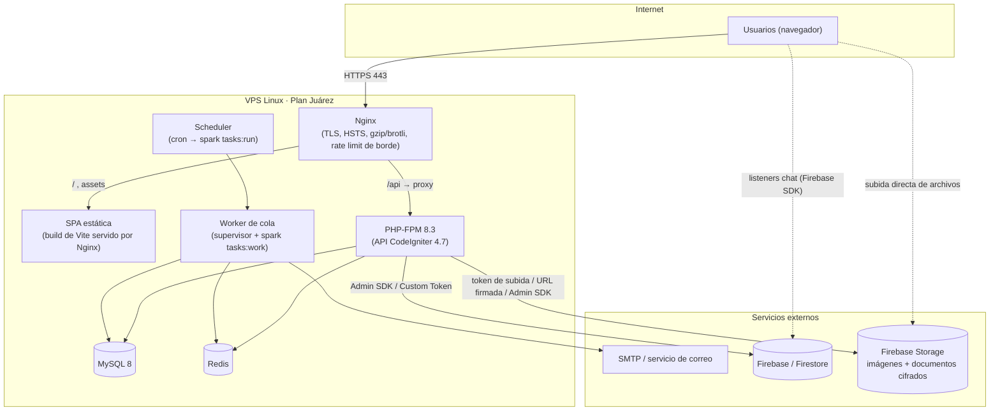

# Arquitectura del Sistema (v2.1)
## Banco de Tiempo · Plataforma de Voluntariado de Habilidades

| Campo | Valor |
|---|---|
| Documento | 02 — Arquitectura del Sistema |
| Versión | **2.1 (CI4 + React/Vite · Firebase Auth/Storage/Firestore)** |
| Fecha | 3 de junio de 2026 |
| Depende de | 01 — SRS, [ADR-006](ADR-006-cambio-stack-ci4-react.md), [ADR-007](ADR-007-firebase-storage-imagenes.md), [ADR-008](ADR-008-firebase-authentication.md) |
| Reemplaza | 02 v1.0 (Laravel + Livewire) |

> **Cambio de stack.** Arquitectura **desacoplada**: backend **API-only en CodeIgniter 4.7** + frontend **SPA en React 19 + Vite** (ADR-006). **Firebase** provee identidad (Authentication, ADR-008), chat (Firestore) y archivos (Storage, ADR-007). La autenticación es por **verificación del ID token de Firebase**; CI4 no emite ni custodia tokens de sesión ni contraseñas. El dominio, el modelo de datos (03) y el plan de seguridad (04) se conservan.

---

## 1. Principios rectores

Las cuatro decisiones no negociables se mantienen, reexpresadas para el nuevo stack:

1. **Una sola fuente de verdad.** MySQL es la autoridad de identidad, autorización y todo el dominio transaccional. Firestore es un *canal* de mensajería, no una autoridad.
2. **Seguridad por diseño.** Cada límite de confianza (request HTTP a la API, escritura en Firestore, acceso a un documento) se valida en el backend antes de ejecutarse. **El cliente —ahora una SPA— nunca es de fiar**: toda regla vive en CI4, jamás en React.
3. **Separación de responsabilidades.** Controladores delgados, lógica en Services, acceso a datos en Repositories, validación declarativa, autorización en PolicyServices.
4. **Asíncrono donde duele.** Correos y tareas pesadas van a cola (Redis). El request HTTP nunca espera por I/O lento.

---

## 2. Estilo arquitectónico

**Cliente-servidor desacoplado**: una SPA React consume una **API REST JSON** servida por un monolito modular CI4 en capas. No es microservicios: para el MVP y un solo VPS, un backend monolítico bien estratificado más una SPA es lo más seguro, barato y operable. La modularidad interna por contexto de dominio deja abierta la extracción futura de servicios.

### 2.1 Diagrama de capas



### 2.2 Responsabilidad de cada capa

| Capa | Responsabilidad | Qué NO hace |
|---|---|---|
| **SPA React** | Renderizar UI, manejar estado de cliente, llamar a la API, escuchar Firestore | Decidir permisos, validar reglas de negocio (solo UX previa) |
| Filter (CI4) | CORS, verificación del ID token de Firebase (`auth-firebase`), RBAC de ruta, throttling, cabeceras de seguridad | Lógica de negocio |
| Controller | Orquestar: recibir, validar formato, delegar al Service, responder JSON | Reglas de negocio, queries directas |
| Validation + DTO | Validar y tipar la entrada | Persistir datos, decidir permisos |
| PolicyService | Decidir si *este usuario* puede ejecutar *esta acción* sobre *este recurso* | Validar formato |
| Service | Reglas de negocio, máquina de estados, transacciones ACID | SQL crudo concatenado |
| Repository | Consultas optimizadas (eager loading manual, índices, columnas selectivas) | Reglas de negocio |
| Model / Entity | Mapeo, `$allowedFields` (anti mass-assignment), casts | Lógica de negocio compleja |
| Command / Cola | Trabajo asíncrono (correo, reportes) | Responder al usuario en tiempo real |
| Event | Reaccionar a hechos del dominio (notificar, auditar) | Bloquear el flujo principal |

---

## 3. Frontera MySQL ↔ Firestore

**Sin cambios respecto a v1.0.** La regla de oro se mantiene: Firestore almacena únicamente los mensajes; el derecho a leer/escribir lo decide siempre CI4 consultando el estado de la vinculación en MySQL.

### 3.1 Flujo de autorización del chat



El cliente nunca recibe credenciales Firebase de amplio alcance; recibe un Custom Token acotado a una conversación, emitido por CI4 solo tras validar MySQL. Las Security Rules de Firestore (documento 04 §3) actúan como segunda barrera.

---

## 4. Autenticación (Firebase Authentication · ADR-008)

La identidad la provee **Firebase Authentication** (email/contraseña, Google, Facebook, Microsoft). El SPA inicia sesión con el SDK de Firebase y obtiene un **ID token** que se refresca solo; CI4 **verifica** ese token en cada petición con el Admin SDK y mapea el `firebase_uid` a un usuario local. CI4 no emite ni almacena tokens de sesión (se eliminó el JWT propio + refresh de la versión anterior).

```mermaid
sequenceDiagram
    participant U as SPA React
    participant FA as Firebase Auth
    participant L as API CI4
    participant DB as MySQL

    U->>FA: signIn (email/contraseña | Google | Facebook | Microsoft)
    FA-->>U: ID token (JWT corto, auto-refrescado por el SDK)
    U->>L: POST /auth/sync  (Authorization: Bearer <idToken>)
    L->>FA: Admin SDK verifyIdToken(idToken)
    FA-->>L: claims {uid, email, email_verified, name, sign_in_provider}
    L->>DB: ¿user con firebase_uid? → si no, crear (JIT)
    DB-->>L: usuario local (id, roles, estado_verificacion)
    L-->>U: perfil + roles + estado de verificación
    Note over U,L: cada petición lleva el ID token; el filtro auth-firebase lo verifica
    U->>FA: el SDK refresca el ID token al expirar (transparente)
```

| Elemento | Vida | Dónde vive | Propiedades |
|---|---|---|---|
| Firebase ID token (JWT RS256) | ~1 h | Gestionado por el SDK de Firebase en el SPA | Claims: `uid`, `email`, `email_verified`, `name`, `firebase.sign_in_provider`. Refresco automático. |
| Mapeo local | — | `users.firebase_uid` en MySQL | Roles (`roles`/`role_user`) y `estado_verificacion` de identidad viven en MySQL |

> CI4 verifica firma (RS256, claves públicas de Google), `exp`, `aud`=projectId, `iss`. Para forzar cierre global: `revokeRefreshTokens(uid)` + `checkRevoked=true` en endpoints sensibles. Al no usar cookies de sesión, el CSRF clásico no aplica.

---

## 5. Patrones de diseño aplicados

| Patrón | Dónde | Para qué |
|---|---|---|
| Repository | `App\Repositories\*` (UserRepository, OfertaRepository, VinculacionRepository) | Aislar el acceso a datos, centralizar queries optimizadas, facilitar pruebas |
| Service | `App\Services\*` (VinculacionService, VerificacionService, ChatTokenService, FirebaseAuthService) | Encapsular reglas de negocio y transacciones |
| PolicyService | `App\Services\Policies\*` | RBAC granular, autorización de objeto, menor privilegio |
| State (máquina de estados) | VinculacionService | Garantizar transiciones válidas de la vinculación |
| Filter | `App\Filters\*` (AuthJwt, Rbac, RateLimit, Cors) | Cortar peticiones no autorizadas antes del controlador |
| Trait (ApiResponder) | `App\Traits\ApiResponder` | Envelope JSON consistente en toda la API |
| Event / Observer | Notificaciones y auditoría | Desacoplar efectos secundarios |
| Custom Hook / Query | React (`useOfertas`, `useAuth`, `useVinculacion`) | Encapsular estado de servidor con TanStack Query |

> DRY y YAGNI: no se introduce un patrón sin necesidad real del MVP.

---

## 6. Módulos del dominio (contextos)

Sin cambios de dominio. Cada módulo agrupa, **en el backend**, sus controladores, services, repositories, policy-services y validaciones; y **en el frontend**, su carpeta de feature (componentes, hooks, tipos).



---

## 7. Arquitectura de despliegue (VPS Plan Juárez)



### 7.1 Componentes de servidor

| Componente | Función | Notas de seguridad |
|---|---|---|
| Nginx | TLS, sirve la SPA estática, proxy `/api` a PHP-FPM, cabeceras, rate limit de borde | TLS 1.2+; HSTS; ocultar tokens de servidor; `try_files` SPA fallback a `index.html` |
| SPA (Vite build) | Archivos estáticos `dist/` | Sin secretos embebidos; solo `VITE_*` públicas (URL de API, config Firebase de cliente) |
| PHP-FPM 8.3 | Ejecuta la API CI4 | Usuario sin privilegios; `open_basedir` acotado; `writable/` fuera del docroot |
| MySQL 8 | Base de datos | Bind a localhost; usuario de app con permisos mínimos; backups cifrados |
| Redis | Caché, cola y throttle | Bind a localhost; `requirepass` |
| Worker | Procesa la cola (correo, reportes) | Supervisado; reinicio automático |
| Scheduler | Cron de CI4 (recordatorios, limpieza, recordatorios de reseña) | Un solo cron |
| Firebase Storage (externo) | Imágenes públicas (oferta/perfil, vía CDN) y documentos de identidad (prefijo privado, blob cifrado app-side) | Subida directa con token acotado de CI4; bucket privado deny-by-default; descarga de documentos solo por URL firmada efímera para moderador + auditoría (ADR-007) |

### 7.2 Entornos

| Entorno | Propósito |
|---|---|
| Local | Desarrollo (Docker Compose: php-fpm, mysql, redis, node/vite) |
| Staging | QA con datos sintéticos |
| Producción | VPS Plan Juárez, HTTPS forzado, `CI_ENVIRONMENT=production`, debug toolbar off |

> Ningún secreto se versiona. Cada entorno tiene su `.env` (CI4) y `.env.{mode}` (Vite) fuera de git. Las credenciales de Firebase Admin se almacenan como archivo con permisos `0600`, referenciado por ruta en el `.env` de CI4.

---

## 8. Estructura de carpetas (monorepo)

```
banco-de-tiempo/
├── apps/
│   ├── api/                      # CodeIgniter 4.7 (backend API-only)
│   │   ├── app/
│   │   │   ├── Config/           # Routes, Cors, Filters, Security...
│   │   │   ├── Controllers/Api/V1/
│   │   │   ├── Filters/          # AuthFirebase, Rbac, RateLimit, Cors
│   │   │   ├── Services/         # lógica de negocio por contexto
│   │   │   │   └── Policies/     # PolicyServices (autorización)
│   │   │   ├── Repositories/     # acceso a datos por agregado
│   │   │   ├── Models/ · Entities/
│   │   │   ├── Validation/       # reglas y DTOs de entrada
│   │   │   ├── Events/ · Commands/
│   │   │   └── Traits/           # ApiResponder
│   │   ├── tests/                # Unit · Feature (HTTP)
│   │   └── writable/             # fuera del docroot
│   └── web/                      # React 19 + Vite (frontend SPA)
│       ├── src/
│       │   ├── app/              # router, providers, layout
│       │   ├── features/         # auth (Firebase), ofertas, vinculaciones, chat, admin...
│       │   ├── components/ui/    # UI kit (design tokens)
│       │   ├── lib/              # cliente API, query client, firebase init
│       │   └── styles/           # tokens.css (design system)
│       └── vite.config.ts
├── docker-compose.yml
└── README.md
```

> El filtro de autenticación de CI4 es `auth-firebase` (verifica el ID token con el Admin SDK). No hay `TokenService` propio ni tabla `refresh_tokens`: la identidad la gestiona Firebase Authentication (ADR-008).

---

## 9. Decisiones registradas (ADR)

| ADR | Decisión | Motivo |
|---|---|---|
| ADR-01 | Monolito modular (API) | Tamaño MVP, un solo VPS, menor superficie de ataque |
| ADR-02 | MySQL como fuente de verdad | Integridad ACID y agregaciones para métricas |
| ADR-03 | Firestore solo para chat | Tiempo real sin operar infraestructura propia |
| ADR-04 | Verificación manual en MVP | Costo y alcance; difiere a v2 |
| ADR-05 | Custom Tokens acotados para Firestore | Menor privilegio; el backend autoriza cada conversación |
| **[ADR-06](ADR-006-cambio-stack-ci4-react.md)** | **CodeIgniter 4 + React/Vite** | **Frontend desacoplado y fluido; camino directo a móvil; paridad con el prototipo React** |
| **[ADR-07](ADR-007-firebase-storage-imagenes.md)** | **Firebase Storage para imágenes y documentos** | **Un solo almacén de archivos + CDN; subida directa con token acotado; PII cifrada app-side** |
| **[ADR-08](ADR-008-firebase-authentication.md)** | **Firebase Authentication (sustituye el JWT propio)** | **Identidad unificada (email + Google/Facebook/Microsoft); sin custodia de contraseñas ni refresh en el backend** |

---

*Documento 02 v2.1 de la documentación técnica de Banco de Tiempo · Plan Juárez · 3-jun-2026*
