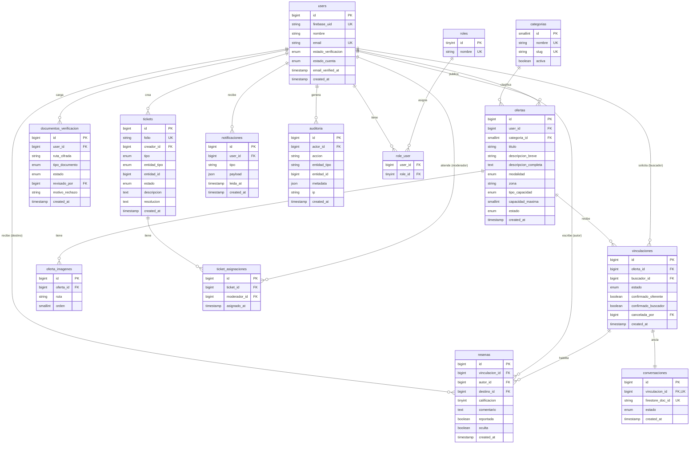

# Modelo de Datos
## Banco de Tiempo · Plataforma de Voluntariado de Habilidades

| Campo | Valor |
|---|---|
| Documento | 03 — Modelo de Datos (ERD · Diccionario · DDL) |
| Versión | 2.1 (Firebase Auth: `users.firebase_uid`, sin `password_hash` ni `refresh_tokens` — ADR-008) |
| Fecha | 3 de junio de 2026 |
| Motor | MySQL 8.0+ (InnoDB, utf8mb4) |
| Normalización | 3NF |
| Depende de | 01 — SRS, 02 — Arquitectura, [ADR-008](../02-arquitectura/ADR-008-firebase-authentication.md) |

> **v2.1 (ADR-008).** La autenticación pasa a Firebase Authentication. En `users` se añade `firebase_uid` (mapeo de identidad) y se **elimina `password_hash`**. Se **elimina la tabla `refresh_tokens`** (Firebase gestiona los tokens de sesión). El resto del modelo de dominio no cambia. Las imágenes y documentos viven en Firebase Storage (ADR-007).

---

## 1. Diagrama Entidad-Relación



---

## 2. Diccionario de datos (resumen por entidad)

### users
Cuenta de persona. **La autenticación la gestiona Firebase Authentication (ADR-008)**: la contraseña/credenciales viven en Firebase, no en MySQL. Esta tabla mapea el `firebase_uid` al usuario local y guarda el dominio (perfil, estados, roles). Un mismo usuario puede actuar como oferente y buscador; el rol funcional se deriva de su actividad. Los roles administrativos se modelan en `roles`/`role_user`.

| Columna | Tipo | Restricción | Descripción |
|---|---|---|---|
| id | BIGINT UNSIGNED | PK | — |
| firebase_uid | VARCHAR(128) | UNIQUE, NOT NULL | UID de Firebase Authentication (identidad emitida por Firebase) |
| nombre | VARCHAR(120) | NOT NULL | Nombre visible (del proveedor o capturado al completar registro) |
| email | VARCHAR(180) | UNIQUE, NOT NULL | Correo (espejo del de Firebase) |
| bio | VARCHAR(500) | NULL | Biografía breve |
| foto_perfil | VARCHAR(255) | NULL | Ruta de avatar (Firebase Storage) |
| estado_verificacion | ENUM | NOT NULL, default `no_verificado` | Verificación de **identidad** (documento + moderador): `no_verificado`, `pendiente`, `verificado`, `rechazado` |
| estado_cuenta | ENUM | NOT NULL, default `activa` | `activa`, `suspendida`, `baja` |
| email_verified_at | TIMESTAMP | NULL | Espejo de `email_verified` de Firebase (verificación del **correo**) |
| created_at / updated_at | TIMESTAMP | — | Auditoría temporal |

> **No hay `password_hash`**: las credenciales las custodia Firebase. `estado_verificacion` (identidad) y `email_verified_at` (correo) son conceptos distintos (ADR-008 §5).

### roles / role_user
RBAC administrativo. Roles iniciales: `super_admin`, `moderador`. Los usuarios estándar no requieren fila en `role_user`.

### categorias
Catálogo de categorías de oferta. Administrable. Iniciales: Arte y Dibujo, Manualidades, Música, Deportes, Idiomas, Tecnología, Cocina, Danza, Fotografía, Otras.

### ofertas
Publicación de una habilidad. `estado`: `borrador`, `activa`, `pausada`, `eliminada`. `modalidad`: `presencial`, `virtual`. `tipo_capacidad`: `individual`, `grupal`.

### oferta_imagenes
Galería opcional 1:N de una oferta. `ruta` referencia al objeto en **Firebase Storage** (prefijo público `publico/{uid}/...`, servido por CDN — ADR-007). **Nunca almacena el binario.** La foto de perfil (`users.foto_perfil`) sigue la misma convención.

### documentos_verificacion
Referencia al documento de identidad cifrado. **Nunca almacena el binario**, solo la ruta al objeto en **Firebase Storage** (prefijo privado `privado/identidad/{uid}/...`, deny-by-default — ADR-007). El blob se cifra app-side antes de subirse. `estado`: `pendiente`, `aprobado`, `rechazado`. `revisado_por` referencia al moderador.

### vinculaciones
El match. `estado`: `solicitada`, `aceptada`, `rechazada`, `completada`, `cancelada`. La doble confirmación se modela con `confirmado_oferente` y `confirmado_buscador`; ambos `true` permiten transición a `completada`.

### conversaciones
Ancla 1:1 entre una vinculación y su hilo de chat en Firestore. `firestore_doc_id` enlaza al documento de Firestore. `estado`: `habilitada`, `cerrada`. La existencia de la fila no autoriza por sí sola: la autorización se recalcula contra el estado de la vinculación.

### resenas
Reseña mutua. Restricción de unicidad (`vinculacion_id`, `autor_id`): una sola reseña por autor por vinculación. `oculta` permite moderación sin borrado físico.

### tickets / ticket_asignaciones
Reportes y sugerencias. `folio` único legible. `entidad_tipo` indica qué se reporta (`usuario`, `oferta`, `mensaje`, `resena`). Asignación N:M histórica con moderadores.

### notificaciones
Notificaciones in-app. El envío por correo se hace vía Jobs; esta tabla respalda el centro de notificaciones.

### auditoria
Registro inmutable de acciones sensibles (verificaciones, suspensiones, acceso a chat bajo reporte). Solo INSERT; nunca UPDATE/DELETE desde la aplicación.

---

## 3. DDL — MySQL 8

```sql
-- =====================================================================
-- Banco de Tiempo — Esquema relacional (MySQL 8, InnoDB, utf8mb4)
-- Normalizado a 3NF. Tipos óptimos, índices compuestos, FKs explícitas.
-- =====================================================================
SET NAMES utf8mb4;
SET time_zone = '+00:00';

-- ---------- Roles y RBAC -------------------------------------------------
CREATE TABLE roles (
    id      TINYINT UNSIGNED NOT NULL AUTO_INCREMENT,
    nombre  VARCHAR(40) NOT NULL,
    PRIMARY KEY (id),
    UNIQUE KEY uq_roles_nombre (nombre)
) ENGINE=InnoDB DEFAULT CHARSET=utf8mb4 COLLATE=utf8mb4_unicode_ci;

-- ---------- Usuarios -----------------------------------------------------
-- La autenticación la gestiona Firebase (ADR-008): sin password_hash. firebase_uid mapea la identidad.
CREATE TABLE users (
    id                   BIGINT UNSIGNED NOT NULL AUTO_INCREMENT,
    firebase_uid         VARCHAR(128) NOT NULL,           -- UID de Firebase Authentication
    nombre               VARCHAR(120) NOT NULL,
    email                VARCHAR(180) NOT NULL,
    bio                  VARCHAR(500) NULL,
    foto_perfil          VARCHAR(255) NULL,
    estado_verificacion  ENUM('no_verificado','pendiente','verificado','rechazado')
                         NOT NULL DEFAULT 'no_verificado',
    estado_cuenta        ENUM('activa','suspendida','baja') NOT NULL DEFAULT 'activa',
    email_verified_at    TIMESTAMP NULL,                  -- espejo de email_verified de Firebase
    created_at           TIMESTAMP NULL,
    updated_at           TIMESTAMP NULL,
    PRIMARY KEY (id),
    UNIQUE KEY uq_users_firebase_uid (firebase_uid),
    UNIQUE KEY uq_users_email (email),
    KEY idx_users_estado_verif (estado_verificacion),
    KEY idx_users_estado_cuenta (estado_cuenta)
) ENGINE=InnoDB DEFAULT CHARSET=utf8mb4 COLLATE=utf8mb4_unicode_ci;

CREATE TABLE role_user (
    user_id  BIGINT UNSIGNED NOT NULL,
    role_id  TINYINT UNSIGNED NOT NULL,
    PRIMARY KEY (user_id, role_id),
    KEY idx_role_user_role (role_id),
    CONSTRAINT fk_ru_user FOREIGN KEY (user_id) REFERENCES users(id) ON DELETE CASCADE,
    CONSTRAINT fk_ru_role FOREIGN KEY (role_id) REFERENCES roles(id) ON DELETE CASCADE
) ENGINE=InnoDB DEFAULT CHARSET=utf8mb4 COLLATE=utf8mb4_unicode_ci;

-- ---------- Categorías ---------------------------------------------------
CREATE TABLE categorias (
    id      SMALLINT UNSIGNED NOT NULL AUTO_INCREMENT,
    nombre  VARCHAR(80) NOT NULL,
    slug    VARCHAR(90) NOT NULL,
    activa  BOOLEAN NOT NULL DEFAULT TRUE,
    PRIMARY KEY (id),
    UNIQUE KEY uq_categorias_nombre (nombre),
    UNIQUE KEY uq_categorias_slug (slug)
) ENGINE=InnoDB DEFAULT CHARSET=utf8mb4 COLLATE=utf8mb4_unicode_ci;

-- ---------- Ofertas ------------------------------------------------------
CREATE TABLE ofertas (
    id                  BIGINT UNSIGNED NOT NULL AUTO_INCREMENT,
    user_id             BIGINT UNSIGNED NOT NULL,
    categoria_id        SMALLINT UNSIGNED NOT NULL,
    titulo              VARCHAR(140) NOT NULL,
    descripcion_breve   VARCHAR(200) NOT NULL,
    descripcion_completa TEXT NOT NULL,
    modalidad           ENUM('presencial','virtual') NOT NULL,
    zona                VARCHAR(120) NULL,           -- requerido si presencial (regla de negocio)
    tipo_capacidad      ENUM('individual','grupal') NOT NULL DEFAULT 'individual',
    capacidad_maxima    SMALLINT UNSIGNED NOT NULL DEFAULT 1,
    disponibilidad      JSON NULL,                   -- {mananas, tardes, fines_semana}
    estado              ENUM('borrador','activa','pausada','eliminada') NOT NULL DEFAULT 'activa',
    created_at          TIMESTAMP NULL,
    updated_at          TIMESTAMP NULL,
    PRIMARY KEY (id),
    KEY idx_ofertas_user (user_id),
    KEY idx_ofertas_categoria (categoria_id),
    -- Índice compuesto para la consulta más frecuente: explorar activas por categoría/modalidad
    KEY idx_ofertas_explorar (estado, categoria_id, modalidad),
    CONSTRAINT fk_ofertas_user FOREIGN KEY (user_id) REFERENCES users(id) ON DELETE CASCADE,
    CONSTRAINT fk_ofertas_categoria FOREIGN KEY (categoria_id) REFERENCES categorias(id)
) ENGINE=InnoDB DEFAULT CHARSET=utf8mb4 COLLATE=utf8mb4_unicode_ci;

CREATE TABLE oferta_imagenes (
    id        BIGINT UNSIGNED NOT NULL AUTO_INCREMENT,
    oferta_id BIGINT UNSIGNED NOT NULL,
    ruta      VARCHAR(255) NOT NULL,
    orden     SMALLINT UNSIGNED NOT NULL DEFAULT 0,
    PRIMARY KEY (id),
    KEY idx_oferta_imagenes_oferta (oferta_id),
    CONSTRAINT fk_oimg_oferta FOREIGN KEY (oferta_id) REFERENCES ofertas(id) ON DELETE CASCADE
) ENGINE=InnoDB DEFAULT CHARSET=utf8mb4 COLLATE=utf8mb4_unicode_ci;

-- ---------- Documentos de verificación ----------------------------------
CREATE TABLE documentos_verificacion (
    id              BIGINT UNSIGNED NOT NULL AUTO_INCREMENT,
    user_id         BIGINT UNSIGNED NOT NULL,
    ruta_cifrada    VARCHAR(255) NOT NULL,          -- ruta al objeto en Firebase Storage (prefijo privado), blob cifrado; jamás el binario
    tipo_documento  ENUM('ine','pasaporte','licencia','otro') NOT NULL DEFAULT 'ine',
    estado          ENUM('pendiente','aprobado','rechazado') NOT NULL DEFAULT 'pendiente',
    revisado_por    BIGINT UNSIGNED NULL,
    motivo_rechazo  VARCHAR(255) NULL,
    created_at      TIMESTAMP NULL,
    updated_at      TIMESTAMP NULL,
    PRIMARY KEY (id),
    KEY idx_docver_user (user_id),
    KEY idx_docver_estado (estado),
    CONSTRAINT fk_docver_user FOREIGN KEY (user_id) REFERENCES users(id) ON DELETE CASCADE,
    CONSTRAINT fk_docver_revisor FOREIGN KEY (revisado_por) REFERENCES users(id) ON DELETE SET NULL
) ENGINE=InnoDB DEFAULT CHARSET=utf8mb4 COLLATE=utf8mb4_unicode_ci;

-- ---------- Vinculaciones (el match) ------------------------------------
CREATE TABLE vinculaciones (
    id                    BIGINT UNSIGNED NOT NULL AUTO_INCREMENT,
    oferta_id             BIGINT UNSIGNED NOT NULL,
    buscador_id           BIGINT UNSIGNED NOT NULL,
    estado                ENUM('solicitada','aceptada','rechazada','completada','cancelada')
                          NOT NULL DEFAULT 'solicitada',
    confirmado_oferente   BOOLEAN NOT NULL DEFAULT FALSE,
    confirmado_buscador   BOOLEAN NOT NULL DEFAULT FALSE,
    cancelada_por         BIGINT UNSIGNED NULL,
    aceptada_at           TIMESTAMP NULL,
    completada_at         TIMESTAMP NULL,
    created_at            TIMESTAMP NULL,
    updated_at            TIMESTAMP NULL,
    PRIMARY KEY (id),
    -- Evita solicitudes duplicadas activas del mismo buscador a la misma oferta.
    UNIQUE KEY uq_vinc_activa (oferta_id, buscador_id, estado),
    KEY idx_vinc_buscador (buscador_id),
    KEY idx_vinc_estado (estado),
    CONSTRAINT fk_vinc_oferta FOREIGN KEY (oferta_id) REFERENCES ofertas(id) ON DELETE CASCADE,
    CONSTRAINT fk_vinc_buscador FOREIGN KEY (buscador_id) REFERENCES users(id) ON DELETE CASCADE,
    CONSTRAINT fk_vinc_cancelapor FOREIGN KEY (cancelada_por) REFERENCES users(id) ON DELETE SET NULL
) ENGINE=InnoDB DEFAULT CHARSET=utf8mb4 COLLATE=utf8mb4_unicode_ci;

-- ---------- Conversaciones (ancla a Firestore) --------------------------
CREATE TABLE conversaciones (
    id                BIGINT UNSIGNED NOT NULL AUTO_INCREMENT,
    vinculacion_id    BIGINT UNSIGNED NOT NULL,
    firestore_doc_id  VARCHAR(128) NOT NULL,
    estado            ENUM('habilitada','cerrada') NOT NULL DEFAULT 'habilitada',
    created_at        TIMESTAMP NULL,
    updated_at        TIMESTAMP NULL,
    PRIMARY KEY (id),
    UNIQUE KEY uq_conv_vinc (vinculacion_id),
    UNIQUE KEY uq_conv_fsdoc (firestore_doc_id),
    CONSTRAINT fk_conv_vinc FOREIGN KEY (vinculacion_id) REFERENCES vinculaciones(id) ON DELETE CASCADE
) ENGINE=InnoDB DEFAULT CHARSET=utf8mb4 COLLATE=utf8mb4_unicode_ci;

-- ---------- Reseñas ------------------------------------------------------
CREATE TABLE resenas (
    id              BIGINT UNSIGNED NOT NULL AUTO_INCREMENT,
    vinculacion_id  BIGINT UNSIGNED NOT NULL,
    autor_id        BIGINT UNSIGNED NOT NULL,
    destino_id      BIGINT UNSIGNED NOT NULL,
    calificacion    TINYINT UNSIGNED NOT NULL,      -- 1..5 (validado en capa de servicio + CHECK)
    comentario      TEXT NULL,
    reportada       BOOLEAN NOT NULL DEFAULT FALSE,
    oculta          BOOLEAN NOT NULL DEFAULT FALSE,
    created_at      TIMESTAMP NULL,
    updated_at      TIMESTAMP NULL,
    PRIMARY KEY (id),
    -- Una sola reseña por autor por vinculación.
    UNIQUE KEY uq_resena_autor (vinculacion_id, autor_id),
    KEY idx_resena_destino (destino_id),
    CONSTRAINT fk_resena_vinc FOREIGN KEY (vinculacion_id) REFERENCES vinculaciones(id) ON DELETE CASCADE,
    CONSTRAINT fk_resena_autor FOREIGN KEY (autor_id) REFERENCES users(id) ON DELETE CASCADE,
    CONSTRAINT fk_resena_destino FOREIGN KEY (destino_id) REFERENCES users(id) ON DELETE CASCADE,
    CONSTRAINT chk_resena_calif CHECK (calificacion BETWEEN 1 AND 5)
) ENGINE=InnoDB DEFAULT CHARSET=utf8mb4 COLLATE=utf8mb4_unicode_ci;

-- ---------- Tickets ------------------------------------------------------
CREATE TABLE tickets (
    id            BIGINT UNSIGNED NOT NULL AUTO_INCREMENT,
    folio         VARCHAR(20) NOT NULL,
    creador_id    BIGINT UNSIGNED NOT NULL,
    tipo          ENUM('reporte','sugerencia') NOT NULL,
    entidad_tipo  ENUM('usuario','oferta','mensaje','resena','otro') NOT NULL DEFAULT 'otro',
    entidad_id    BIGINT UNSIGNED NULL,
    estado        ENUM('abierto','en_proceso','resuelto','cerrado') NOT NULL DEFAULT 'abierto',
    descripcion   TEXT NOT NULL,
    resolucion    TEXT NULL,
    created_at    TIMESTAMP NULL,
    updated_at    TIMESTAMP NULL,
    PRIMARY KEY (id),
    UNIQUE KEY uq_tickets_folio (folio),
    KEY idx_tickets_creador (creador_id),
    KEY idx_tickets_estado (estado),
    CONSTRAINT fk_tickets_creador FOREIGN KEY (creador_id) REFERENCES users(id) ON DELETE CASCADE
) ENGINE=InnoDB DEFAULT CHARSET=utf8mb4 COLLATE=utf8mb4_unicode_ci;

CREATE TABLE ticket_asignaciones (
    id           BIGINT UNSIGNED NOT NULL AUTO_INCREMENT,
    ticket_id    BIGINT UNSIGNED NOT NULL,
    moderador_id BIGINT UNSIGNED NOT NULL,
    asignado_at  TIMESTAMP NOT NULL DEFAULT CURRENT_TIMESTAMP,
    PRIMARY KEY (id),
    KEY idx_tasig_ticket (ticket_id),
    KEY idx_tasig_mod (moderador_id),
    CONSTRAINT fk_tasig_ticket FOREIGN KEY (ticket_id) REFERENCES tickets(id) ON DELETE CASCADE,
    CONSTRAINT fk_tasig_mod FOREIGN KEY (moderador_id) REFERENCES users(id) ON DELETE CASCADE
) ENGINE=InnoDB DEFAULT CHARSET=utf8mb4 COLLATE=utf8mb4_unicode_ci;

-- ---------- Notificaciones ----------------------------------------------
CREATE TABLE notificaciones (
    id          BIGINT UNSIGNED NOT NULL AUTO_INCREMENT,
    user_id     BIGINT UNSIGNED NOT NULL,
    tipo        VARCHAR(60) NOT NULL,
    payload     JSON NULL,
    leida_at    TIMESTAMP NULL,
    created_at  TIMESTAMP NULL,
    PRIMARY KEY (id),
    KEY idx_notif_user_leida (user_id, leida_at),
    CONSTRAINT fk_notif_user FOREIGN KEY (user_id) REFERENCES users(id) ON DELETE CASCADE
) ENGINE=InnoDB DEFAULT CHARSET=utf8mb4 COLLATE=utf8mb4_unicode_ci;

-- ---------- Auditoría (append-only) -------------------------------------
CREATE TABLE auditoria (
    id           BIGINT UNSIGNED NOT NULL AUTO_INCREMENT,
    actor_id     BIGINT UNSIGNED NULL,
    accion       VARCHAR(80) NOT NULL,
    entidad_tipo VARCHAR(60) NOT NULL,
    entidad_id   BIGINT UNSIGNED NULL,
    metadata     JSON NULL,
    ip           VARBINARY(16) NULL,                -- INET6_ATON para IPv4/IPv6
    created_at   TIMESTAMP NOT NULL DEFAULT CURRENT_TIMESTAMP,
    PRIMARY KEY (id),
    KEY idx_audit_actor (actor_id),
    KEY idx_audit_entidad (entidad_tipo, entidad_id),
    CONSTRAINT fk_audit_actor FOREIGN KEY (actor_id) REFERENCES users(id) ON DELETE SET NULL
) ENGINE=InnoDB DEFAULT CHARSET=utf8mb4 COLLATE=utf8mb4_unicode_ci;
```

> **Sin tabla `refresh_tokens` (ADR-008).** La autenticación pasó a Firebase Authentication, que gestiona los tokens de sesión y su refresco. CI4 verifica el ID token por petición y no almacena tokens; la tabla `refresh_tokens` introducida para el esquema JWT propio queda eliminada.

### 3.1 Notas de diseño y rendimiento

- **`idx_ofertas_explorar (estado, categoria_id, modalidad)`**: índice compuesto que cubre la consulta más caliente del sistema (explorar ofertas activas filtradas), evitando full scans. El orden de columnas sigue la selectividad y el patrón de filtrado.
- **`uq_vinc_activa (oferta_id, buscador_id, estado)`**: la unicidad por estado evita solicitudes duplicadas *activas*. Para una regla más estricta ("una sola vinculación viva sin importar estado"), la validación adicional se hace en `VinculacionService` dentro de la transacción, porque MySQL no soporta índices únicos parciales/filtrados como Postgres.
- **`VARBINARY(16)` + `INET6_ATON`** para IPs: óptimo en espacio y soporta IPv6.
- **`JSON` para `disponibilidad`, `payload` y `metadata`**: datos semi-estructurados de baja consulta; no se usa JSON donde se requieren agregaciones (esas viven en columnas tipadas).
- **Tipos ajustados** (`TINYINT`, `SMALLINT`, `BIGINT UNSIGNED`) para minimizar memoria y tamaño de índice.
- **`ON DELETE`** explícito en cada FK: `CASCADE` donde el hijo no tiene sentido sin el padre; `SET NULL` donde se preserva el histórico (revisor, autor de cancelación, actor de auditoría).

### 3.2 Integridad transaccional

Toda operación que toque más de una tabla (aceptar vinculación + crear conversación + notificar; completar + habilitar reseña) se envuelve en una transacción (`$db->transStart()` / `transComplete()`). La máquina de estados de la vinculación se valida en el Service **antes** de persistir, garantizando que MySQL nunca quede en un estado inconsistente.

---

## 4. Modelo de datos de Firestore (chat)

Firestore guarda únicamente los mensajes. Estructura propuesta:

```
conversaciones (colección)
└── {conversacion_id}            ← == conversaciones.firestore_doc_id en MySQL
    ├── vinculacion_id: number    (espejo de solo lectura, para las Security Rules)
    ├── participantes: [uid_a, uid_b]
    ├── creada_en: timestamp
    └── mensajes (subcolección)
        └── {mensaje_id}
            ├── autor_uid: string
            ├── texto: string      (sanitizado en cliente y validado por Cloud Function/Rules)
            ├── enviado_en: timestamp
            └── leido: boolean
```

**Principios:**

- `vinculacion_id` y `participantes` se escriben **solo** desde el backend (Admin SDK) al habilitar el chat. El cliente no puede alterarlos.
- Las Security Rules (documento 04) permiten escribir un mensaje solo si el `request.auth.uid` está en `participantes` y el Custom Token incluye el claim `conversation_id` correspondiente.
- La auditoría bajo reporte se hace leyendo la subcolección con el Admin SDK desde el backend, registrando el acceso en la tabla `auditoria` de MySQL.
- No se guarda PII sensible en los mensajes más allá del texto que los usuarios intercambian voluntariamente.

---

## 5. Datos semilla (seeders)

| Tabla | Semilla inicial |
|---|---|
| roles | `super_admin`, `moderador` |
| categorias | Las 10 categorías iniciales del SRS |
| users | 1 super-administrador: se crea su cuenta en **Firebase Auth** (correo del `.env`) y el seeder inserta la fila local con su `firebase_uid` y el rol `super_admin`. Sin contraseña en MySQL. |

---

## 6. Política de retención

| Dato | Retención |
|---|---|
| Documentos de identidad (blob cifrado en Firebase Storage, prefijo privado) | Se eliminan/anonimizan del bucket tras cumplir su finalidad de verificación o al dar de baja la cuenta, según política aprobada (LFPDPPP). |
| Imágenes de oferta y perfil (Firebase Storage, prefijo público) | Se purgan al eliminar la oferta o dar de baja la cuenta. |
| Mensajes de chat | Se conservan mientras la cuenta esté activa; se purgan al dar de baja, salvo reporte activo. |
| Auditoría | Append-only; retención prolongada por requisitos de trazabilidad. |

---

*Documento 03 de la documentación técnica de Banco de Tiempo · Plan Juárez · v2.1 · 3-jun-2026*
