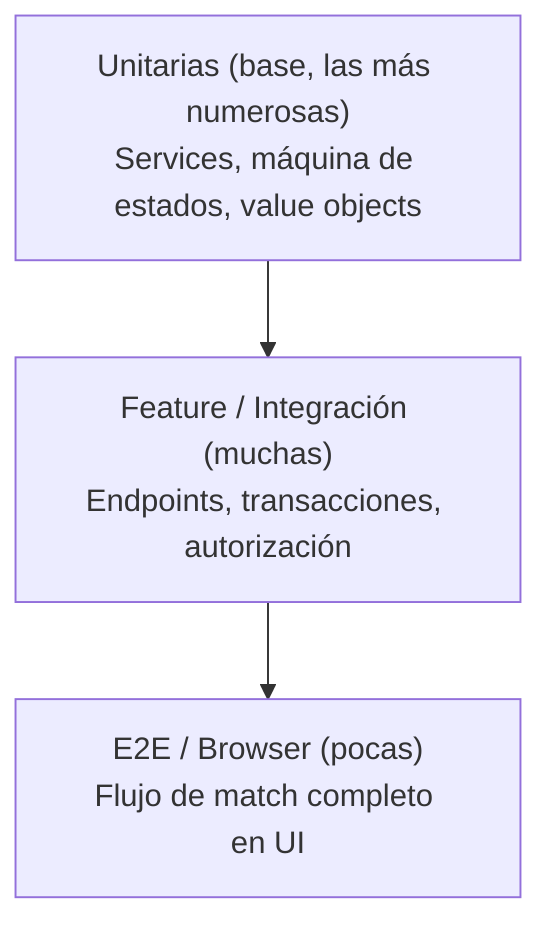

# Plan de Pruebas
## Banco de Tiempo · Plataforma de Voluntariado de Habilidades

| Campo | Valor |
|---|---|
| Documento | 06 — Plan de Pruebas y Trazabilidad |
| Versión | 2.1 (Firebase Auth/Storage — ADR-006/007/008) |
| Fecha | 3 de junio de 2026 |
| Framework | **PHPUnit (CodeIgniter Test) en la API · Vitest + Testing Library en el SPA** |
| Cobertura objetivo | ≥ 80% en Services y flujos críticos |
| Depende de | 01 — SRS, 03 — Datos, 04 — Seguridad, 05 — API, [ADR-006](../02-arquitectura/ADR-006-cambio-stack-ci4-react.md), [ADR-008](../02-arquitectura/ADR-008-firebase-authentication.md) |

> **v2.1.** La estrategia y la matriz de trazabilidad **no cambian**. Las herramientas: PHPUnit (`CIUnitTestCase`, `FeatureTestTrait`, `DatabaseTestTrait`) en el backend; Vitest + React Testing Library en el SPA; Playwright para E2E. **Firebase Auth/Storage/Firestore se *mockean*** en pruebas unitarias/feature (el Admin SDK se sustituye por un doble); las reglas se prueban en el emulador de Firebase.

---

## 1. Estrategia

La pirámide de pruebas para este proyecto prioriza la base (unitarias rápidas) y refuerza el centro (feature/integración) en torno al flujo de vinculación, que es el corazón del negocio y el de mayor riesgo. Las pruebas de seguridad son transversales y bloqueantes para release.



### 1.1 Tipos de prueba

| Tipo | Herramienta | Qué cubre |
|---|---|---|
| Unitaria (API) | PHPUnit (`CIUnitTestCase`) | Lógica pura: máquina de estados, cálculos, validadores, verificación de ID token (mock del Admin SDK) |
| Feature/HTTP (API) | PHPUnit (`FeatureTestTrait` + `DatabaseTestTrait`) | Endpoints, códigos de estado, autorización por filtro y PolicyService |
| Integración (API) | PHPUnit + BD de prueba (migraciones) | Transacciones multi-tabla, repositorios, queries sin N+1 |
| Unitaria/Componente (SPA) | Vitest + React Testing Library | Hooks, componentes UI, lógica de cliente |
| Seguridad | PHPUnit + casos negativos | OWASP: IDOR, escalada de rol, inyección, autorización, verificación de ID token (inválido/revocado) |
| E2E (mínimo) | Playwright | Flujo de match de extremo a extremo en navegador (SPA ↔ API) |
| Estática | PHPStan nivel alto + Rector (API) · ESLint + tsc (SPA) | Tipado y estilo |

### 1.2 Entornos y datos
Base de datos de prueba aislada (`DatabaseTestTrait` con migraciones y *refresh* entre pruebas, o transacciones envolventes). Datos generados con Faker/seeders. Firestore se *mockea* en pruebas unitarias/feature; las Security Rules se prueban aparte con el emulador de Firebase.

---

## 2. Pruebas por módulo

### 2.1 Autenticación (Firebase Authentication)

- `POST /auth/sync` con un ID token de Firebase válido y `firebase_uid` nuevo → crea usuario local `no_verificado` (aprovisionamiento JIT).
- `POST /auth/sync` con `firebase_uid` existente → devuelve el perfil local (idempotente).
- Petición con ID token **inválido/expirado/manipulado** → `401` (el filtro `auth-firebase` rechaza).
- Petición con ID token **revocado** (`checkRevoked=true`) en endpoint sensible → `401`.
- Petición sin header `Authorization` a ruta protegida → `401`.
- Usuario con `estado_cuenta` `suspendida`/`baja` → `403` aunque el token sea válido.
- Deduplicado: dos proveedores con el mismo correo verificado resuelven al mismo usuario local (account linking).
- (Mock del Admin SDK) la verificación valida firma, `exp`, `aud`=projectId, `iss`.

### 2.2 Verificación de identidad

- Subida de documento cifra el binario y guarda solo la ruta (assert: la BD no contiene el binario).
- El usuario pasa a `pendiente` tras subir.
- Un usuario `no_verificado` no puede crear ofertas ni marcar interés → `403`.
- Moderador aprueba → usuario `verificado` + notificación encolada.
- Moderador rechaza con motivo → estado `rechazado` + motivo persistido.
- Un usuario común no puede acceder a `/admin/verificaciones/*` → `403`.

### 2.3 Ofertas

- Oferente verificado crea oferta válida → `201`.
- `modalidad=presencial` sin `zona` → `422`.
- Editar/pausar/eliminar solo por el dueño; otro usuario → `403`.
- Oferta pausada/eliminada no aparece en exploración.
- Payload con `<script>` en descripción se almacena tal cual y se renderiza inerte en React (auto-escape).

### 2.4 Exploración

- Filtro por categoría/modalidad/zona devuelve solo coincidencias.
- Listado no genera N+1 (assert sobre número de queries con el query log del conector).
- Paginación respeta `per_page` máximo de 50.

### 2.5 Vinculación (crítico — máquina de estados)

| Caso | Resultado esperado |
|---|---|
| Buscador verificado marca interés | `201`, vinculación `solicitada` |
| Segundo interés activo a la misma oferta | `409` |
| Oferente acepta | `aceptada`, conversación creada, chat habilitado |
| Aceptar una vinculación ya `rechazada` | `409` |
| Completar sin estar `aceptada` | `409` |
| Una sola parte confirma | sigue `aceptada` |
| Ambas partes confirman | `completada`, reseña habilitada |
| Cancelar tras aceptar | `cancelada`, `cancelada_por` registrado |
| Transición concurrente (dos requests) | una gana; la otra `409`, sin corrupción (transacción) |

> Este conjunto es la red de seguridad del negocio: ninguna ruta puede dejar la vinculación en estado ilegal.

### 2.6 Chat

- Solicitar token de chat en vinculación `solicitada` → `409`.
- Solicitar token siendo ajeno a la vinculación → `403`.
- Token emitido contiene el claim `conversation_id` correcto.
- (Emulador Firebase) Security Rule rechaza escritura sin claim correcto.
- (Emulador) Mensaje >2000 caracteres rechazado.

### 2.7 Reseñas

- Reseñar vinculación no `completada` → `409`.
- Segunda reseña del mismo autor → `409` (unicidad).
- Calificación fuera de 1–5 → `422` (y CHECK en BD).
- Reseña reportada puede ser ocultada por moderador; deja de aparecer en perfil.

### 2.8 Tickets

- Crear ticket devuelve folio único con formato esperado.
- Moderador asigna y cambia estado; cierre exige resolución documentada.

### 2.9 Administración y RBAC

- Moderador NO puede crear/revocar moderadores ni categorías → `403`.
- Super-admin SÍ puede.
- Acceso a `/admin/vinculaciones/{id}/chat` sin reporte activo → `403`; con reporte → `200` y registro en `auditoria`.

### 2.10 Métricas

- Las agregaciones devuelven cifras correctas contra un dataset semilla conocido.
- La respuesta incluye las 8 métricas requeridas.

---

## 3. Pruebas de seguridad (bloqueantes)

| ID | Prueba | OWASP |
|---|---|---|
| SEC-01 | IDOR: acceder a oferta/vinculación/documento ajeno por ID → `403`/`404` | A01 |
| SEC-02 | Escalada de privilegios: usuario común llama endpoints admin → `403` | A01 |
| SEC-03 | Inyección SQL en filtros de exploración no altera la consulta | A03 |
| SEC-04 | XSS almacenado en oferta/reseña se neutraliza al renderizar en React | A03 |
| SEC-05 | ID token de Firebase inválido/expirado/revocado → `401`; sin token en ruta protegida → `401` | A07 |
| SEC-06 | El backend no almacena contraseñas (credenciales en Firebase); `users` no tiene `password_hash` | A02 |
| SEC-07 | Documento de identidad no accesible por URL pública directa (bucket privado deny-by-default) | A01/A02 |
| SEC-08 | Acceso admin a chat queda registrado en auditoría | A09 |
| SEC-09 | Rate limit de endpoints sensibles efectivo | A07 |
| SEC-10 | `CI_ENVIRONMENT=production`: error 500 no filtra stack trace | A05 |

---

## 4. Definición de "Hecho" (DoD) por historia

Una historia se considera terminada solo si: el código pasa el análisis estático (PHPStan en la API; ESLint + `tsc` en el SPA), tiene pruebas unitarias y de feature que cubren sus criterios de aceptación, las pruebas de seguridad relevantes pasan, no introduce N+1 en rutas calientes, y la documentación afectada (API/datos) está actualizada.

---

## 5. Integración continua

Pipeline mínimo en cada push/PR:

```
API (apps/api):
  1. composer install
  2. PHPStan (estática)        → falla si baja el nivel
  3. PHPUnit (unit + feature)  → falla si rojo
  4. Cobertura                 → falla si < umbral en Services
  5. composer audit            → falla ante vuln alta/crítica

SPA (apps/web):
  6. npm ci
  7. tsc --noEmit + ESLint     → falla ante errores de tipo/estilo
  8. Vitest                    → falla si rojo
  9. npm audit                 → falla ante vuln alta/crítica

E2E (opcional por PR, obligatorio en main):
 10. Playwright sobre staging  → flujo de match completo
```

---

## 6. Matriz de trazabilidad (requisito → caso de prueba)

| Requisito SRS | Casos de prueba |
|---|---|
| RF-AUT-01..07 | §2.1, SEC-05, SEC-06, SEC-09 |
| RF-VER-01..07 | §2.2, SEC-07 |
| RF-OFE-01..05 | §2.3, SEC-04 |
| RF-EXP-01..05 | §2.4, SEC-03 |
| RF-VIN-01..08 | §2.5 (incluye concurrencia) |
| RF-MSG-01..05 | §2.6, SEC-08 |
| RF-RES-01..05 | §2.7 |
| RF-TIC-01..04 | §2.8 |
| RF-ADM-01..10 | §2.9, SEC-01, SEC-02 |
| RF-MET (§3.11) | §2.10 |

---

*Documento 06 de la documentación técnica de Banco de Tiempo · Plan Juárez · v2.1 · 3-jun-2026*
