# Roadmap por Sprints
## Banco de Tiempo · Plataforma de Voluntariado de Habilidades

| Campo | Valor |
|---|---|
| Documento | 07 — Roadmap de Ejecución por Sprints |
| Versión | 2.2 (CI4 + React/Vite · Firebase Auth/Storage — ADR-006/007/008) |
| Fecha | 9 de junio de 2026 |
| Cadencia | Sprints de 2 semanas |
| Depende de | 01–06, [ADR-006](../02-arquitectura/ADR-006-cambio-stack-ci4-react.md), [ADR-007](../02-arquitectura/ADR-007-firebase-storage-imagenes.md), [ADR-008](../02-arquitectura/ADR-008-firebase-authentication.md) |

> **v2.1.** El orden seguro y los hitos **no cambian**. Las tareas técnicas de Sprint 0–1 reflejan el stack CodeIgniter 4 (API) + React/Vite (SPA) con **Firebase para identidad, chat y archivos**.

---

## 1. Principio de orden seguro

El orden de implementación no es arbitrario: se construye de adentro hacia afuera, asegurando primero los cimientos (identidad, autorización, esquema) antes de exponer superficie de cara al usuario. Nunca se construye una funcionalidad sensible antes que su control de seguridad.

```mermaid
flowchart LR
    S0["Sprint 0<br/>Cimientos"] --> S1["Sprint 1<br/>Auth + RBAC"]
    S1 --> S2["Sprint 2<br/>Verificación"]
    S2 --> S3["Sprint 3<br/>Ofertas + Explorar"]
    S3 --> S4["Sprint 4<br/>Vinculación"]
    S4 --> S5["Sprint 5<br/>Chat + Reseñas"]
    S5 --> S6["Sprint 6<br/>Admin + Métricas"]
    S6 --> S7["Sprint 7<br/>Endurecimiento + Lanzamiento"]
    S7 --> S8["Sprint 8<br/>UX: Mobile + Skeletons"]
    S8 --> S9["Sprint 9<br/>UX: Dark Mode + Charts"]
    S9 --> S10["Sprint 10<br/>UX: Onboarding + Polish"]
```

---

## 2. Sprints

### Sprint 0 — Cimientos (semanas 1–2)
**Objetivo:** monorepo, entornos y esquema listos.

- Monorepo `apps/api` (CodeIgniter 4.7) + `apps/web` (React 19 + Vite + TS + Tailwind 4).
- Estructura de carpetas (Filters, Services, PolicyServices, Repositories, Models) del documento 02.
- Migraciones completas del documento 03 (con `users.firebase_uid`, sin `refresh_tokens`); seeders de roles y categorías.
- Configuración de cola/caché (Redis), correo, CORS, Firebase Admin SDK (Auth + Storage + Firestore) y proyecto de Firebase.
- Pipeline CI: API (PHPStan + PHPUnit + composer audit) y SPA (tsc + ESLint + Vitest + npm audit).
- Hardening base del VPS de staging (HTTPS, Nginx sirve SPA + proxy `/api`, cabeceras).

**DoD:** `spark migrate --all && spark db:seed` corre limpio; `npm run build` del SPA OK; CI verde; staging accesible por HTTPS.

### Sprint 1 — Autenticación y RBAC (semanas 3–4)
- Integración de **Firebase Authentication** en el SPA: email/contraseña + Google + Facebook + Microsoft (RF-AUT-*).
- Filtro `auth-firebase` en CI4: verificación del ID token (Admin SDK), `checkRevoked` en endpoints sensibles.
- Endpoint `/auth/sync` + aprovisionamiento JIT (mapeo `firebase_uid` ↔ usuario local) y deduplicado por correo.
- RBAC: roles en MySQL, filtros `rbac:` y PolicyServices base; MFA de Firebase para administradores.
- Pruebas §2.1 y SEC-05, SEC-06, SEC-09.

**Hito:** un usuario puede iniciar sesión con cualquier proveedor y el backend lo reconoce y autoriza de forma segura.

### Sprint 2 — Verificación de identidad (semanas 5–6)
- Carga cifrada de documentos, estados de verificación (RF-VER-*).
- URLs firmadas efímeras + auditoría de acceso.
- Cola de verificación en panel admin (aprobar/rechazar + notificación).
- Pruebas §2.2 y SEC-07.

**Hito:** un moderador aprueba/rechaza identidades; solo verificados avanzan.

### Sprint 3 — Ofertas y exploración (semanas 7–8)
- CRUD de ofertas con estados; galería opcional (RF-OFE-*).
- Exploración con filtros, tarjetas, detalle; eager loading e índices (RF-EXP-*).
- Sanitización XSS de contenido.
- Pruebas §2.3, §2.4, SEC-04.

**Hito:** buscadores exploran y filtran ofertas reales sin N+1.

### Sprint 4 — Vinculación / Match (semanas 9–10) · *núcleo*
- Marcar interés, máquina de estados completa, transacciones (RF-VIN-*).
- Notificaciones de los eventos del match.
- Doble confirmación para completar.
- Pruebas §2.5 (incluida concurrencia).

**Hito:** flujo interés → aceptar → completar funciona de extremo a extremo y es a prueba de estados ilegales.

### Sprint 5 — Chat y reseñas (semanas 11–12)
- Integración Firestore: ChatTokenService, Custom Tokens acotados, Security Rules (RF-MSG-*).
- Reseña mutua post-completada (RF-RES-*).
- Pruebas §2.6, §2.7, SEC-08 + reglas en emulador.

**Hito:** las partes coordinan por chat tras aceptar y se reseñan tras la actividad.

### Sprint 6 — Administración y métricas (semanas 13–14)
- Gestión de usuarios, ofertas, vinculaciones, reseñas reportadas (RF-ADM-*).
- Tickets de extremo a extremo (RF-TIC-*).
- Dashboard de métricas agregadas + caché (RF-MET).
- Pruebas §2.8, §2.9, §2.10, SEC-02.

**Hito:** el panel admin cumple los criterios del MVP (verificaciones, moderación, tickets, 6+ métricas).

### Sprint 7 — Endurecimiento y lanzamiento (semanas 15–16)
- Ejecución completa del checklist de seguridad (documento 04 §6).
- Pruebas de seguridad §3 completas; pen-test ligero.
- Pruebas E2E del flujo de match en navegador.
- Optimización de queries (`EXPLAIN` sobre rutas calientes), caché de métricas.
- Aviso de privacidad y derechos ARCO; política de retención operativa.
- Backups cifrados + restauración probada; runbook de despliegue.

**Hito:** release candidate del MVP en producción.

### Sprint 8 — UX: Mobile-first y rendimiento percibido (semanas 17–18)
- Layout responsive mobile-first: drawer sidebar, bottom tab bar, breakpoints (§3.1 del doc 09).
- Skeleton loading system: remplazar spinners por skeletons específicos por página (§3.2).
- Sistema de toasts con `sonner` para feedback de mutaciones (§3.3).
- Persistencia de filtros en URL con `useSearchParams` (§3.5).
- Chips de categoría scrolleables y radio pills de modalidad en ExplorarPage (BUS-01/02/03).
- Componente `DataTable` responsive reutilizable para tablas admin (§6.2).
- Progress indicator en vinculación cards (BUS-13).

**Hito:** la app es usable en mobile; las cargas se perciben fluidas; filtros son compartibles por URL; tablas admin se adaptan a cualquier pantalla.

### Sprint 9 — UX: Dark mode, charts y real-time (semanas 19–20)
- Dark mode: tokens CSS oscuros + toggle manual en TopBar (§3.4).
- Chat en tiempo real: badges de no leídos + typing indicator en Firestore (BUS-18/19).
- Wizard multi-paso para crear oferta con progress bar y preview (OFE-05/06/07).
- Dashboard de métricas con `recharts`: gráficas reales + selector de período (ADM-01/02).
- Quick actions en vinculaciones y panel del oferente (BUS-14, OFE-01).
- Sticky CTA mobile en detalle de oferta (BUS-08).
- Split view para verificaciones admin (ADM-07/08).

**Hito:** el oferente tiene dashboard actionable; gráficos admin son reales; chat con indicadores en tiempo real; dark mode disponible.

### Sprint 10 — UX: Onboarding, polish y accesibilidad (semanas 21–22)
- View Transitions API para navegación entre páginas (§3.6).
- Onboarding flow: welcome modal + profile completion banner + confetti (§7.1).
- Vista Kanban para tickets admin con drag-and-drop (ADM-12/13).
- Command palette (⌘K / Ctrl+K) para navegación rápida (§10).
- Keyboard shortcuts en admin: verificaciones, tickets (ADM-10).
- In-app notification center + Web Push notifications (OFE-10/11).
- Accesibilidad avanzada: focus trap, live regions, skip link, reduced motion (§8).

**Hito:** experiencia pulida y profesional; onboarding guía a usuarios nuevos; admin con workflows optimizados.

> **Detalle completo:** [09 — Plan de Mejoras UX/UI](../08-ux/09_plan_mejoras_ux.md).

---

## 3. Cobertura de criterios de aceptación del MVP

| Criterio MVP | Sprint que lo cierra |
|---|---|
| Registro + carga de documentos en 3 roles | S1–S2 |
| Admin aprueba/rechaza verificaciones | S2 |
| Exploración con ≥3 filtros | S3 |
| Match de extremo a extremo | S4–S5 |
| Marcar actividad completada (doble confirmación) | S4 |
| Tickets con folio y cambio de estado | S6 |
| ≥6 métricas con datos reales | S6 |

---

## 4. Riesgos y mitigaciones

| Riesgo | Impacto | Mitigación |
|---|---|---|
| Complejidad de la frontera MySQL↔Firestore | Alto | Aislar en ChatTokenService; probar reglas en emulador desde S5 |
| Fugas de PII (documentos de identidad) | Crítico | Cifrado app-side + bucket privado deny-by-default + URL firmada + auditoría desde S2; checklist en S7 (ADR-007) |
| Estados ilegales de vinculación | Alto | Máquina de estados en Service + pruebas de concurrencia S4 |
| Dependencia de Firebase (Auth + Firestore + Storage) | Medio | Aislar el Admin SDK tras servicios propios; manejar caídas con errores claros; Sprint 0 dedicado a estabilizar la integración |
| Mapeo/deduplicado de cuentas entre proveedores | Medio | Account linking de Firebase + correo verificado como clave de unificación (ADR-008) |
| Alcance creep hacia features v2 | Medio | Backlog v2 separado; DoD estricto |

---

## 5. Backlog v2 (no MVP)

Verificación automatizada de identidad · apps nativas · recomendaciones. Cada uno entra a planeación solo tras estabilizar los Sprints 8–10 en producción.

> El **login social** (Google, Facebook, Microsoft), antes en este backlog, se adelantó al MVP al adoptar Firebase Authentication (ADR-008).
> Las **push notifications**, **mapa interactivo** y **dark mode**, antes en este backlog, se adelantaron a los Sprints 8–10 (doc 09).

---

*Documento 07 de la documentación técnica de Banco de Tiempo · Plan Juárez · v2.2 · 9-jun-2026*
